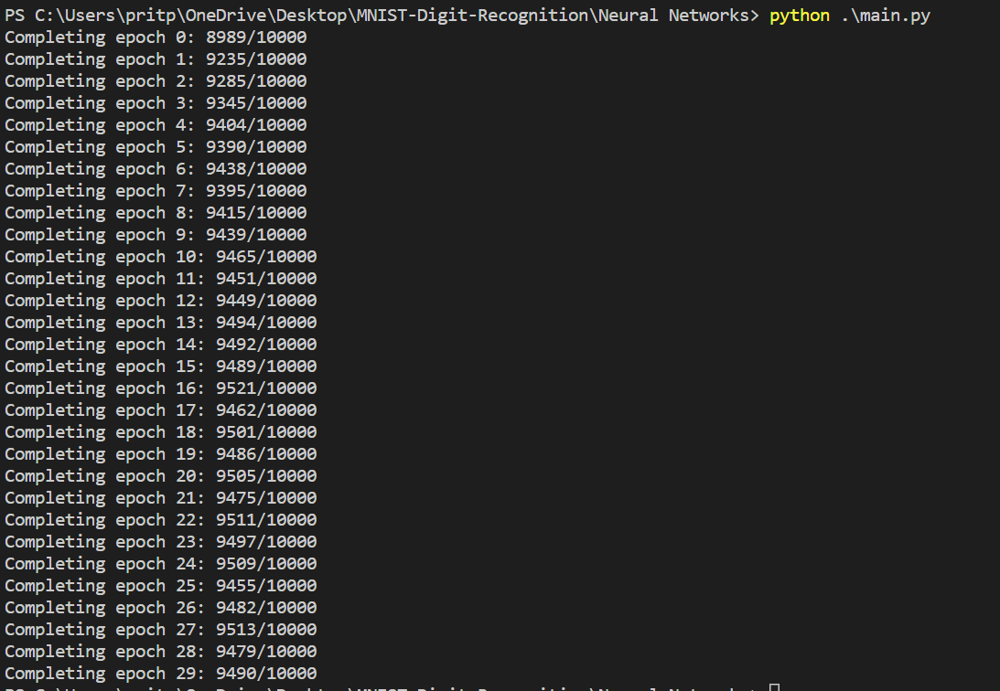
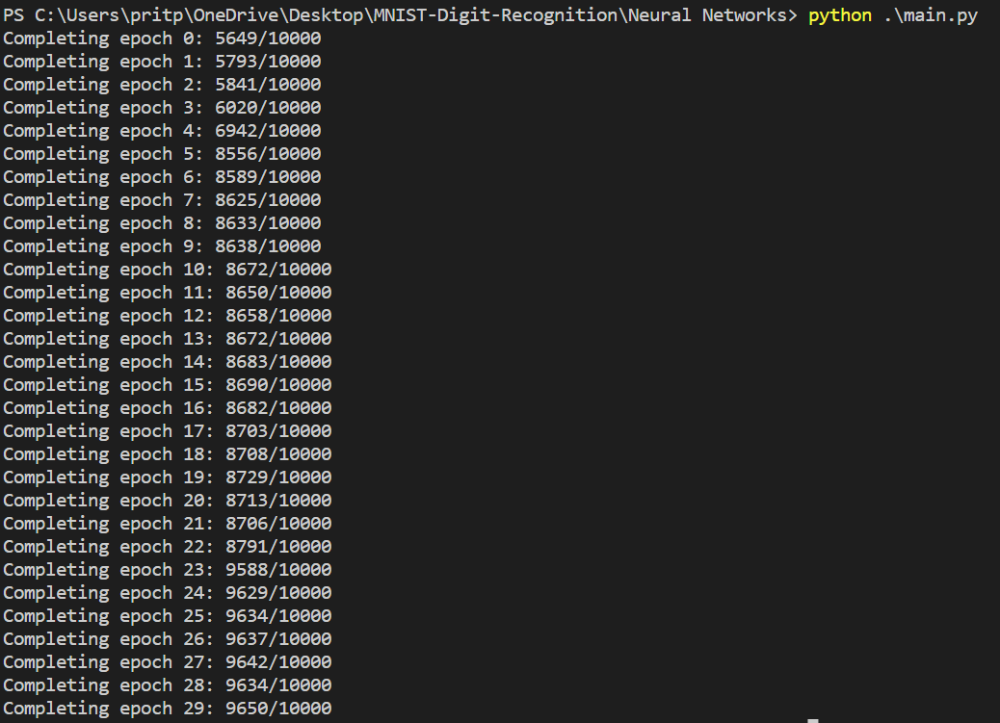
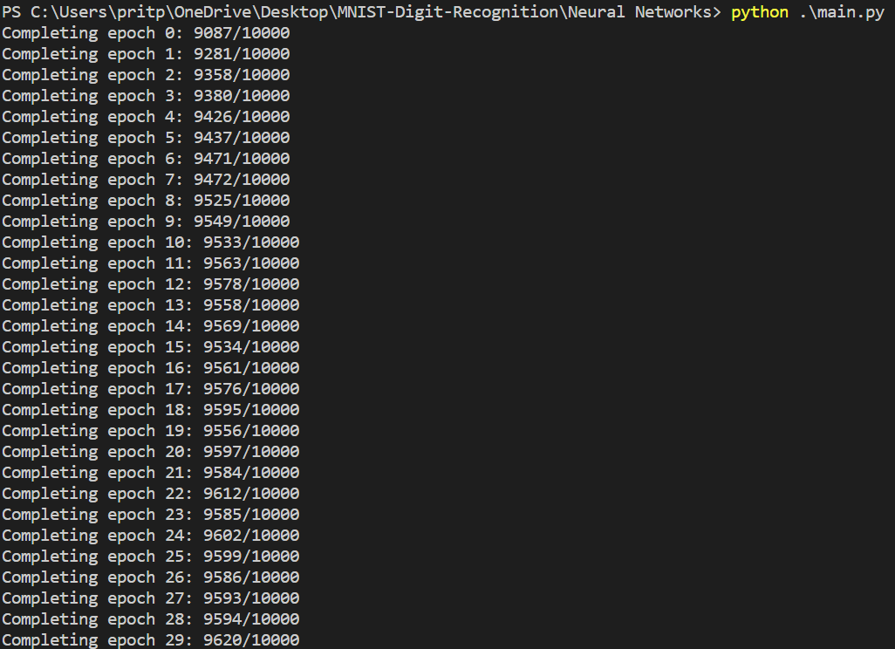

# MNIST-Digit-Recognition

# Table of Contents

# About
# Approach 1: Using Vanilla Neural Networks

## Method 1: Using SGD learning algorithm

### Description

Implementing <b>stochastic gradient descent</b> learning algorithm for a vanilla neural network. Here, the gradients are calculated using backpropagation algorithm. The model uses the quadratic cost function(MSE) and the sigmoid activation function for all the layers except the input layer.

### Usage

```python vanilla_neural_network.py```

### Results

* Using a single hidden layer with 30 neurons

* Using a single hidden layer with 100 neurons

* Using two hidden layers with 50 and 30 neurons respectively

## References

* <a href = "http://neuralnetworksanddeeplearning.com/index.html" >Neural Network and Deep Learning</a> by Michael Nielsen