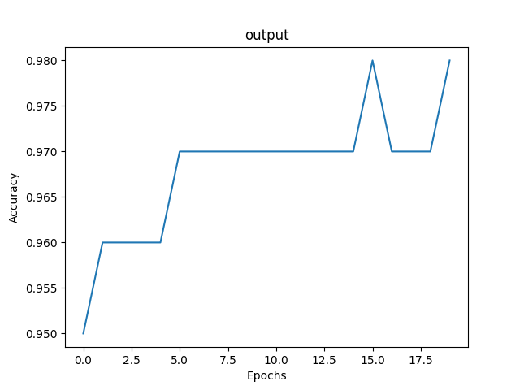
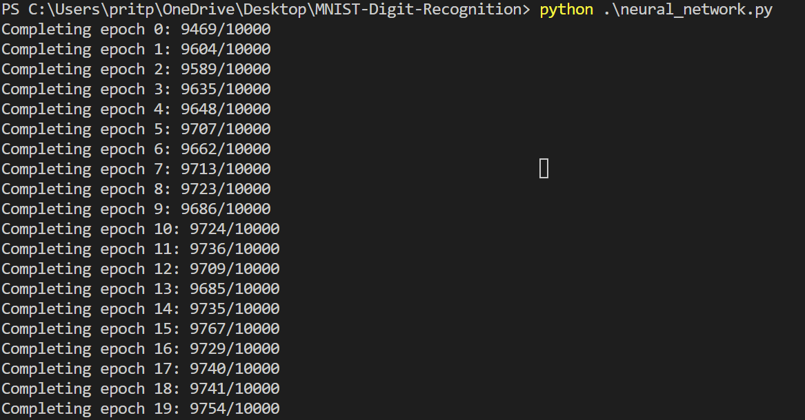

# MNIST-Digit-Recognition


## Table of Contents

- [Project](#MNIST-Digit-Recognition)
  - [Table of Contents](#table-of-contents)
  - [About The Project](#about-the-project)
  - [File Structure](#file-structure)
  - [Logistic Regression](#logistic-regression)
  - [Neural Networks](#neural-networks)
  - [Convolutional Neural Networks](#convolutional-neural-networks)
  - [Getting started](#Getting-Started)
  - [Contributors](#contributors)
  - [Acknowledgements and Resources](#acknowledgements-and-references)
  - [License](#license)

## About

Implementing Deep Learning for Handwritten Digit Recognition from scratch

## File Structure

```
👨‍💻MNIST-Digit-Recognition
 ┣ 📂assets                            // Contains all the reference gifs, results images
 ┃ ┣ 📂results
 ┣ 📂data                              // MNIST dataset
 ┃ ┣ 📄mnist.pkl.gz
 ┣ 📂documentation                     // Documentation
 ┣ 📄neural_network.py
 ┣ 📄README.md

```
## Neural Networks

### Method 1: Initialing parameters with zeros

#### Results


### Method 2: Initialing parameters randomly

#### Results


### Method 3: Initialing parameters using He initialization

#### Results


### Method 4: Implementing L2 regularization with He initialization

#### Results



### Method 5: Implementing dropout regularization with He initialization

#### Results


## Getting Started

### Prerequisites
To download and use this code, the following python libraries are required:

* ```numpy```
* ```matplotlib```
* ```pickle```
* ```gzip```

### Installation

Clone the project by typing the following command in your Terminal/CommandPrompt

```
git clone https://github.com/PritK99/MNIST-Digit-Recognition
```
Navigate to the MNIST-Digit-Recognition folder

```
cd MNIST-Digit-Recognition
```

### Usage

Once the requirements are satisfied, use the following commands to run the respective python file:

```
python <name_of_the_file.py>
```


## Contributors

* [Prit Kanadiya](https://github.com/PritK99)

## Acknowledgements and Resources

* <a href = "http://neuralnetworksanddeeplearning.com/index.html" >Neural Network and Deep Learning</a> by Michael Nielsen.
* <a href="https://www.coursera.org/learn/deep-neural-network?specialization=deep-learning">Improving Deep Neural Networks: Hyperparameter Tuning, Regularization and Optimization</a> taught by Andrew NG, delivered through Coursera.

## License
[MIT License](https://opensource.org/licenses/MIT)